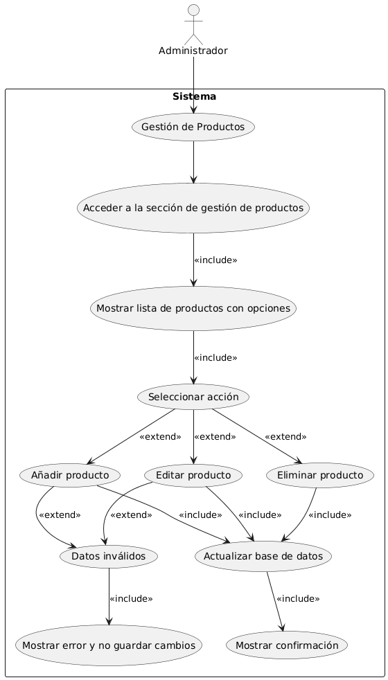
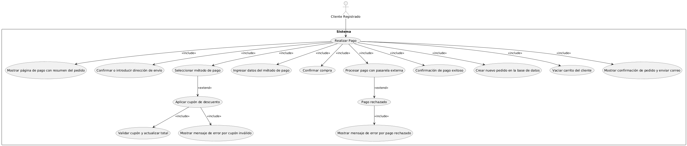
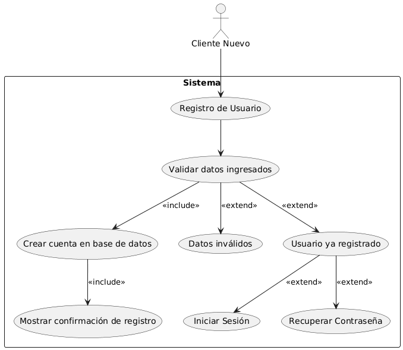
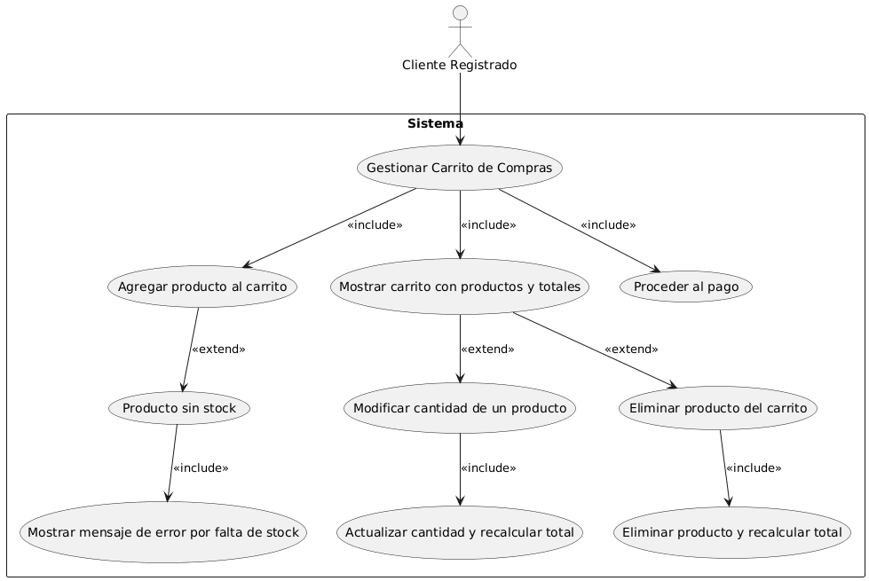
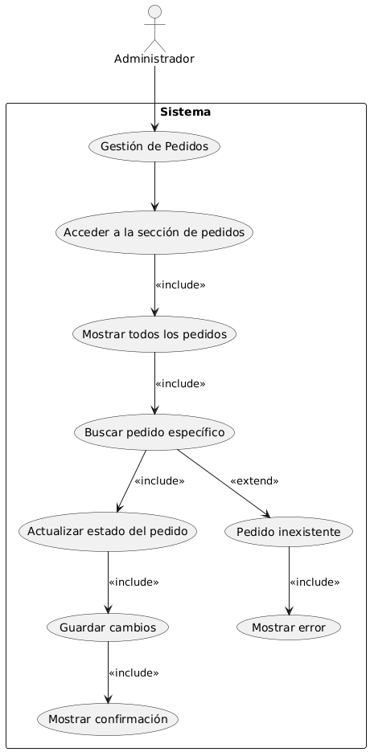
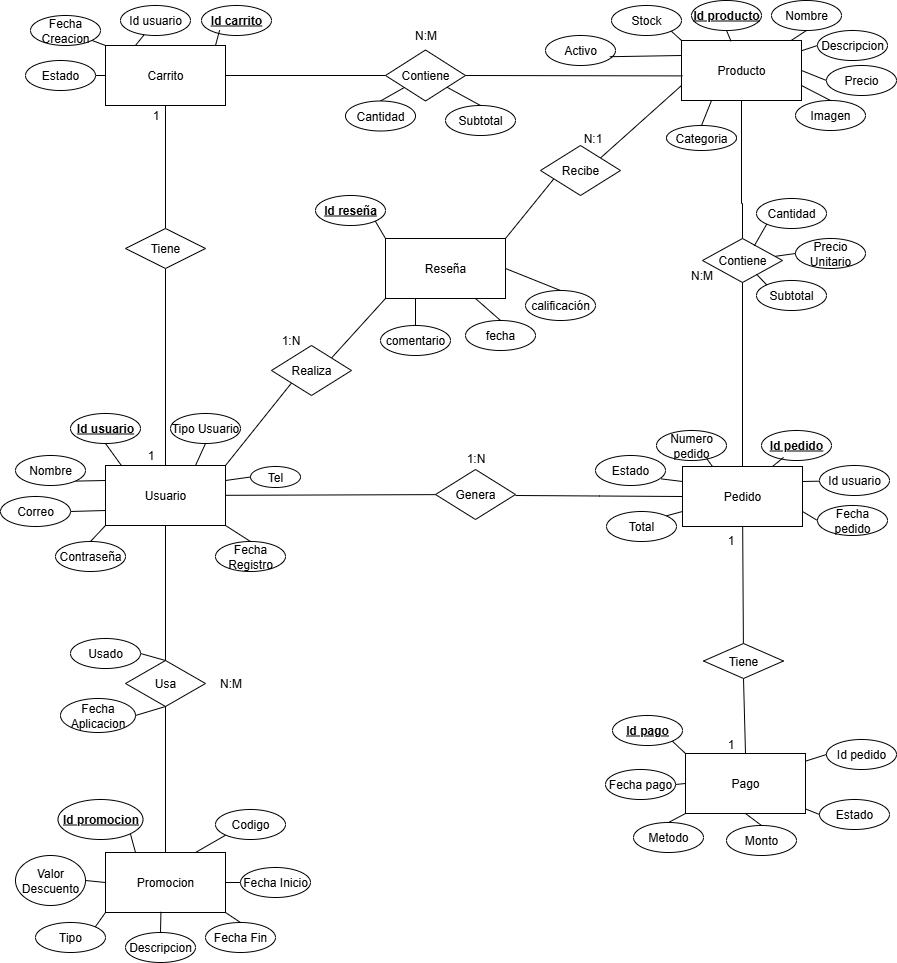
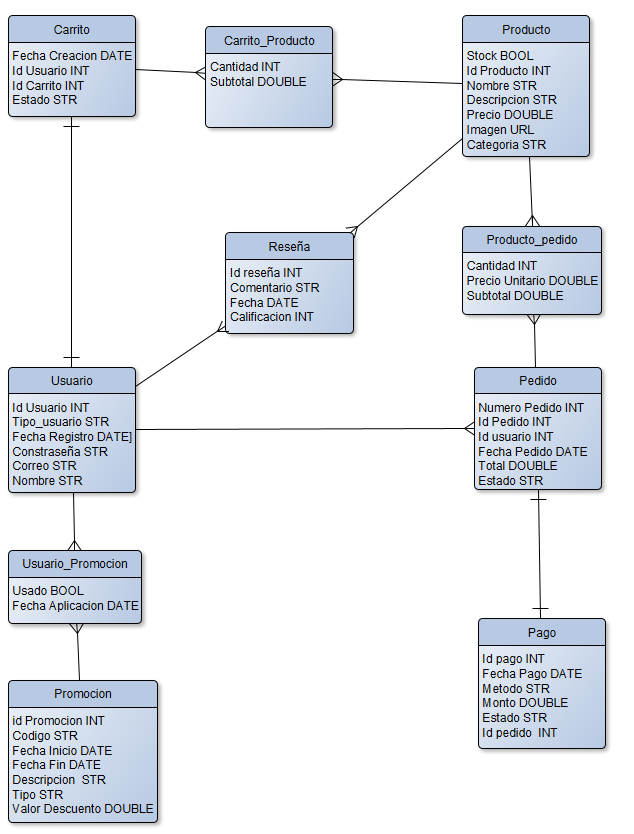
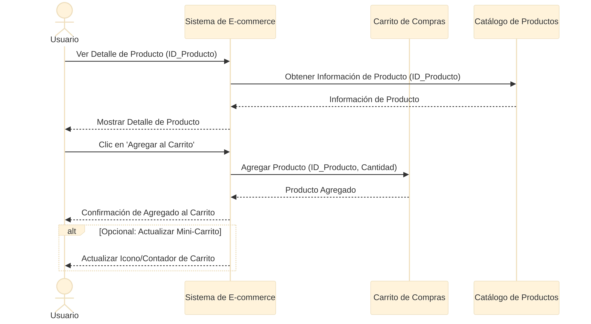
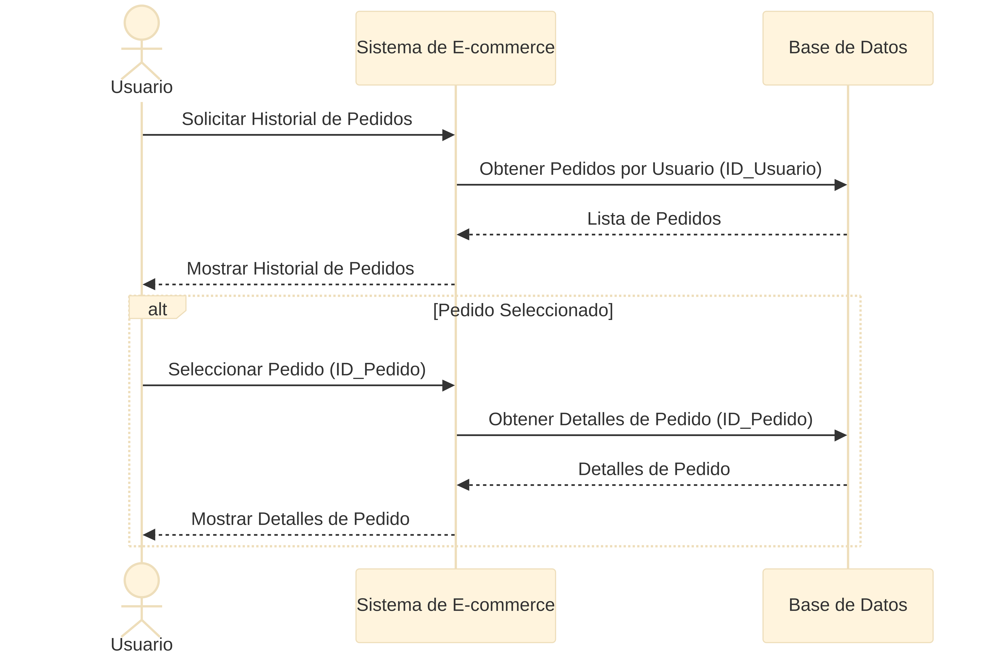
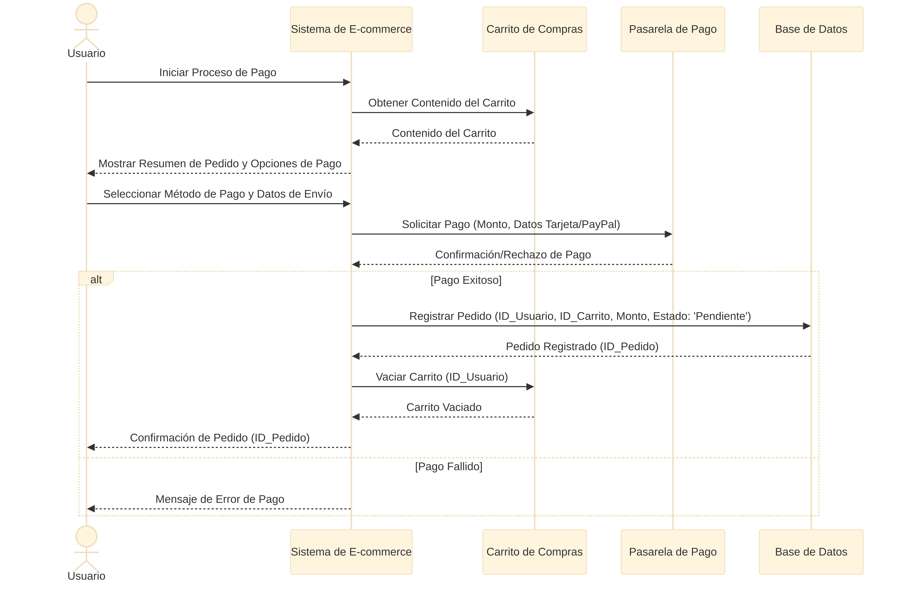

# Marketplace App

[](https://www.oracle.com/java/)
[](https://openjfx.io/)
[](https://www.sqlite.org/)
[](https://maven.apache.org/)

Una aplicación de escritorio robusta y moderna para la gestión de un Marketplace. Este sistema permite la interacción entre clientes y administradores en un entorno seguro y eficiente.

---

## Características Principales

### Gestión de Usuarios
- **Registro e Inicio de Sesión:** Sistema de autenticación seguro con roles diferenciados (Cliente y Administrador).
- **Perfiles Personalizables:** Los usuarios pueden gestionar su información personal y direcciones de envío.

### Experiencia de Compra
- **Catálogo Interactivo:** Exploración de productos con filtros por categorías y búsqueda.
- **Detalle de Producto:** Información detallada, imágenes y reseñas de otros compradores.
- **Carrito de Compras:** Gestión dinámica de productos (agregar, eliminar, actualizar cantidades).
- **Checkout y Pagos:** Proceso de confirmación de pedido con integración de métodos de pago simulados.

### Gestión de Pedidos
- **Historial de Compras:** Los clientes pueden seguir el estado y detalle de sus pedidos anteriores.
- **Reseñas y Calificaciones:** Sistema de feedback para productos adquiridos.

### Panel Administrativo
- **Gestión de Inventario (CRUD):** Control total sobre el catálogo de productos (crear, leer, actualizar, eliminar).
- **Control de Usuarios:** Administración de la base de usuarios registrada.
- **Monitoreo de Pedidos:** Gestión centralizada de todas las órdenes realizadas en la plataforma.

---

## Tecnologías Utilizadas

- **Lenguaje:** [Java 17](https://www.oracle.com/java/technologies/javase-jdk17-doc-downloads.html)
- **Interfaz Gráfica:** [JavaFX 17](https://openjfx.io/) con FXML y CSS personalizado.
- **Base de Datos:** [SQLite](https://www.sqlite.org/) para persistencia local de datos.
- **Gestor de Dependencias:** [Maven](https://maven.apache.org/) para la automatización de la construcción.

---

## Arquitectura del Proyecto

El proyecto sigue una arquitectura limpia basada en patrones de diseño industriales:

- **Model-View-Controller (MVC):** Separación clara entre la lógica de negocio, la interfaz de usuario y el control de eventos.
- **Data Access Object (DAO):** Capa de abstracción para la interacción con la base de datos.
- **Service Layer:** Centraliza la lógica de negocio y coordina la comunicación entre controladores y DAOs.
- **Singleton:** Utilizado en el `SessionManager` para la gestión de la sesión del usuario actual.

```text
src/main/java/com/example/marketplace/
├── controller/  # Lógica de las vistas FXML
├── dao/         # Acceso a datos (SQL)
├── model/       # Entidades de datos
├── service/     # Lógica de negocio
├── utils/       # Clases de apoyo y validaciones
└── Main.java    # Punto de entrada
```

---

## Casos de Uso

El sistema está diseñado para satisfacer las necesidades de dos tipos principales de usuarios: **Clientes** y **Administradores**.

### 1. Gestión de Productos (Administrador)

Permite al administrador gestionar el catálogo del sistema.
- **Acciones:** Añadir, editar y eliminar productos.
- **Validaciones:** El sistema verifica que los datos ingresados sean válidos antes de actualizar la base de datos y muestra una confirmación o un mensaje de error según sea necesario.

### 2. Realizar Pago (Cliente)

Proceso mediante el cual un cliente finaliza su compra.
- **Flujo:** El cliente visualiza el resumen, confirma su dirección, selecciona un método de pago y procesa la transacción.
- **Integraciones:** Incluye validación de cupones de descuento, procesamiento con pasarela externa (simulada), vaciado automático del carrito tras el éxito y envío de confirmación por correo.

### 3. Registro de Usuario (Cliente Nuevo)

Flujo para que nuevos usuarios se incorporen a la plataforma.
- **Validación:** El sistema verifica que el usuario no exista previamente y que los datos sean correctos.
- **Manejo de errores:** Si el usuario ya está registrado, se ofrecen opciones para iniciar sesión o recuperar la contraseña.

### 4. Gestionar Carrito de Compras (Cliente)

Permite la administración dinámica de los productos que el cliente desea adquirir.
- **Funcionalidades:** Agregar productos al carrito (validando stock disponible), modificar cantidades y eliminar ítems.
- **Recálculo:** El sistema actualiza automáticamente los totales tras cada modificación.

### 5. Gestión de Pedidos (Administrador)

Facilita el control y seguimiento de todas las órdenes generadas en el marketplace.
- **Funcionalidades:** Listado total de pedidos, búsqueda de pedidos específicos por ID y actualización del estado de entrega.
- **Confirmación:** Cada cambio de estado es validado y confirmado por el sistema.

---

## Modelo de Datos

El sistema utiliza una base de datos relacional para gestionar la persistencia de la información.

### Diagramas de Modelo de Datos

*Diagrama Entidad-Relación (Conceptual)*


*Modelo Relacional (Lógico)*

### Entidades Principales
- **Usuario:** Almacena la información de clientes y administradores (nombre, correo, contraseña, tipo de usuario, fecha de registro).
- **Producto:** Contiene el catálogo de artículos disponibles (nombre, descripción, precio, stock, imagen, categoría).
- **Carrito:** Gestiona los productos temporales seleccionados por un usuario antes de la compra.
- **Pedido:** Registra las transacciones finalizadas, vinculando usuarios con productos y estados de entrega.
- **Pago:** Almacena el detalle de la transacción financiera (método, monto, fecha, estado).
- **Reseña:** Permite a los usuarios calificar y comentar sobre los productos adquiridos.
- **Promoción:** Sistema de descuentos aplicables a los pedidos.

### Relaciones Clave
- **Usuario - Pedido (1:N):** Un usuario puede generar múltiples pedidos.
- **Pedido - Pago (1:1):** Cada pedido tiene un único registro de pago asociado.
- **Producto - Reseña (1:N):** Un producto puede recibir múltiples calificaciones de distintos usuarios.
- **Carrito/Pedido - Producto (N:M):** Relaciones gestionadas a través de tablas intermedias (`Carrito_Producto` y `Producto_Pedido`) para manejar cantidades y subtotales por cada ítem.
- **Usuario - Promoción (N:M):** Seguimiento de qué promociones han sido aplicadas por cada usuario.

---

## Diagramas de Secuencia

A continuación se presentan los flujos de interacción clave dentro del sistema:

### 1. Autenticación y Registro

Describe el proceso de validación de credenciales y la creación de nuevas cuentas de usuario.
- **Inicio de Sesión:** El sistema verifica las credenciales con la base de datos. Si son válidas, se genera un token de sesión; de lo contrario, se muestra un mensaje de error.
- **Registro:** Los datos del nuevo usuario se validan y se guardan en la base de datos, notificando al usuario tras el éxito del proceso.

### 2. Gestión de Carrito y Catálogo

Muestra cómo el usuario interactúa con los productos disponibles.
- **Detalle de Producto:** El sistema obtiene la información del catálogo según el ID solicitado.
- **Agregar al Carrito:** Al seleccionar 'Agregar', el sistema actualiza el carrito de compras y sincroniza el contador visual de la interfaz.

### 3. Consulta de Historial y Detalles de Pedido

Permite a los usuarios revisar sus transacciones pasadas.
- **Historial:** Se recupera la lista de pedidos asociados al ID del usuario desde la base de datos.
- **Detalles:** Al seleccionar un pedido específico, el sistema consulta y muestra la información detallada de los productos y montos correspondientes.

### 4. Proceso de Pago (Checkout)

El flujo crítico de finalización de compra.
- **Validación:** El sistema obtiene el contenido actual del carrito y solicita el pago a través de una pasarela externa.
- **Finalización:** Si el pago es exitoso, se registra el pedido con estado 'Pendiente', se vacía el carrito del usuario y se muestra la confirmación. En caso de falla, se informa al usuario sobre el error.

---

## Instalación y Configuración

### Requisitos Previos
- **JDK 17** o superior instalado.
- **Maven** configurado en el sistema.
- Un IDE compatible (IntelliJ IDEA recomendado).

### Pasos para Ejecutar
1. **Clonar el repositorio:**
   ```bash
   git clone https://github.com/SofiaRV03/marketplace.git
   cd marketplace
   ```

2. **Instalar dependencias:**
   ```bash
   mvn install
   ```

3. **Ejecutar la aplicación:**
   ```bash
   mvn javafx:run
   ```

> **Nota:** La base de datos SQLite se inicializará automáticamente en la carpeta `data/` al ejecutar la aplicación por primera vez.

---

## Licencia
MIT

---

Desarrollado por **Sofia Restrepo Villegas**.
